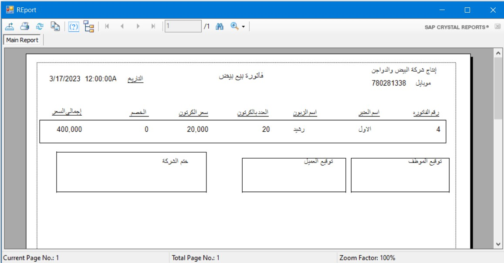

# Eggs Project

Eggs Project is a Windows Forms Application developed using **C#** and the **Guna UI Framework**. It serves as a management system for egg production and sales, providing functionalities to handle clients, employees, suppliers, and reports efficiently.

## Features

- User authentication system (Login/Logout).
- Manage clients, employees, and suppliers.
- Generate and print sales and purchase reports.
- Intuitive graphical interface using Guna UI.
- Database integration for storing and retrieving information.

## Installation and Setup

1. Clone the repository: `git clone https://github.com/your-username/EGGS_PROJECT.git`
2. Open the solution file (`EGGS_PROJECT.sln`) in Visual Studio.
3. Restore NuGet packages if needed.
4. Configure the database connection in `DataAccessLayer.cs`.
5. Build and run the application.

## Screenshots

- Inventory Management  
  

- Invoice Printing  
  

- Statistics Dashboard  
  

- User Management  
  

- Production Data Entry  
  

---

# مشروع إدارة البيض

مشروع إدارة البيض هو تطبيق Windows Forms تم تطويره باستخدام **C#** وإطار عمل **Guna UI**. يهدف إلى إنشاء نظام إدارة لإنتاج وبيع البيض، مع توفير وظائف لإدارة العملاء، الموظفين، الموردين، والتقارير بكفاءة.

## المميزات

- نظام تسجيل الدخول والخروج.
- إدارة العملاء، الموظفين، والموردين.
- إنشاء وطباعة تقارير المبيعات والمشتريات.
- واجهة رسومية بديهية باستخدام Guna UI.
- تكامل مع قاعدة بيانات لتخزين واسترجاع المعلومات.

## خطوات التثبيت والإعداد

1. نسخ المستودع: `git clone https://github.com/your-username/EGGS_PROJECT.git`
2. افتح ملف الحل (`EGGS_PROJECT.sln`) باستخدام Visual Studio.
3. استعادة حزم NuGet إذا لزم الأمر.
4. إعداد اتصال قاعدة البيانات في ملف `DataAccessLayer.cs`.
5. قم ببناء وتشغيل التطبيق.

## لقطات الشاشة

